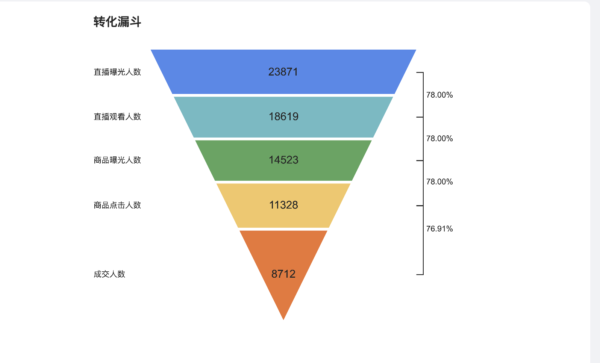

<p align="center" style="color: #343a40">
  
  <h1 align="center">Welcome to kuririn-funnel-chart</h1>
</p>

English | [简体中文](https://github.com/jiqishoubi/kuririn-funnel-chart/blob/main/README.zh-CN.md)

A funnel chart with straight lines on both sides

## 预览



## options

```ts
export interface IKuririnFunnelChartOptions {
  title?: {
    text: string
  }
  data: Array<{
    value: number
    name?: string
    color?: string
  }>
  style?: {
    funnelWidth?: string | number
    gap?: number // The gap in the funnel
  }
}
```

## 例 1

```html
<script src="./umd/kuririn-funnel-chart.1.0.1.js"></script>
<style>
  #main {
    width: 505px;
    height: 360px;
    background-color: #fff;
  }
</style>
<script>
  window.onload = function () {
    const myChart = kuririnFunnelChart.init(document.getElementById('main'))
    myChart.setOption({
      data: [
        { name: '直播曝光人数', value: 23871, color: '#5087ec' },
        { name: '直播观看人数', value: 18619, color: '#68bbc4' },
        { name: '商品曝光人数', value: 14523, color: '#58a65c' },
        { name: '商品点击人数', value: 11328, color: '#f2bd42' }, //
        { name: '成交人数', value: 8712, color: '#ee7530' }, //
      ],
    })
  }
</script>
<div id="main"></div>
</html>
```

## 例 2

```ts
import React, { useEffect } from 'react'
import kuririnFunnelChart from 'kuririn-funnel-chart'

const Index: React.FC = () => {
  useEffect(() => {
    const myChart = kuririnFunnelChart.init(document.getElementById('main') as HTMLDivElement)
    myChart.setOption({
      data: [
        { name: '直播曝光人数', value: 23871, color: '#5087ec' },
        { name: '直播观看人数', value: 18619, color: '#68bbc4' },
        { name: '商品曝光人数', value: 14523, color: '#58a65c' },
        { name: '商品点击人数', value: 11328, color: '#f2bd42' }, //
        { name: '成交人数', value: 8712, color: '#ee7530' }, //
      ],
    })
  }, [])

  return (
    <>
      <div
        id="main"
        style={{
          boxSizing: 'content-box',
          width: 505,
          height: 360,
          backgroundColor: '#fff',
        }}
      ></div>
    </>
  )
}

export default Index
```
